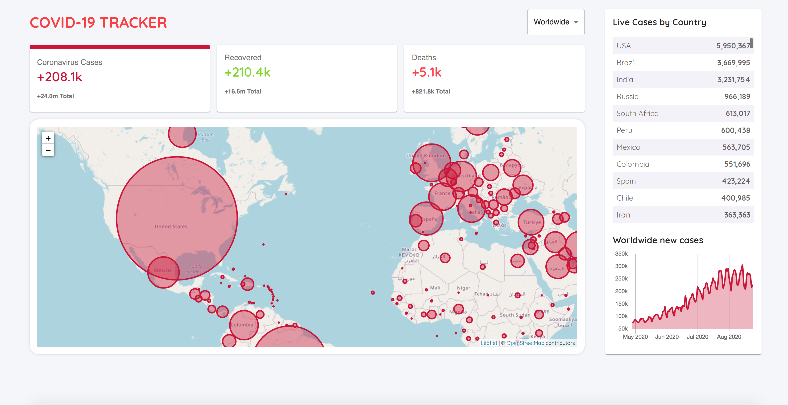

<h1 align="center">
    
</h1>

## 💻 About project

Personal project built using ReactJS, pure CSS with BEM methodology and Material-UI Framework. This is a Covid-19 tracker which you can access and viasualize useful data from cases, recovered cases and deaths about every country of our world, through disease.sh API. It has an interactive world map which you can explore (leaflet map) and make it easier for you to locate the countries who is facing big troubles against corona virus.

Demo: https://githubclonelmr.netlify.app/

## 🛠 Technology

#### **Website**

-   **[HTML5](https://developer.mozilla.org/pt-BR/docs/Web/HTML/HTML5)**
-   **[CSS3](https://www.w3schools.com/css/)**
-   **[ReactJs](https://pt-br.reactjs.org/)**
-   **[Material-UI](https://material-ui.com/pt/)**
-   **[Leaftlet](https://leafletjs.com/)**
-   **[Numeral.js](http://numeraljs.com/)**
-   **[Chart.js](https://www.chartjs.org/)**

#### **Utilitaries**

-   Editor: **[Visual Studio Code](https://code.visualstudio.com/)**
-   API: **[Disease.sh](https://corona.lmao.ninja/)**

### Prerequisites

Before you begin, you will need to have the following tool installed on your machine:
[Git](https://git-scm.com)

In addition, it is good to have an editor to work with the code as **[VSCode](https://code.visualstudio.com/)**

### Running the web application (Front End)

```bash
# Clone this repository
$ git clone https://github.com/luizmr/covid19-tracker-app.git

# Access the project folder in the cmd/terminal
$ cd covid19-tracker-app

# Use the command below to install all dependencies
$ npm install

# Run the application on terminal
$ npm start

# The server is now running at localhost:3000
```

## 📝 License

This project is under the MIT license.

Made with ❤️ by Luiz Marcelo Rocha
